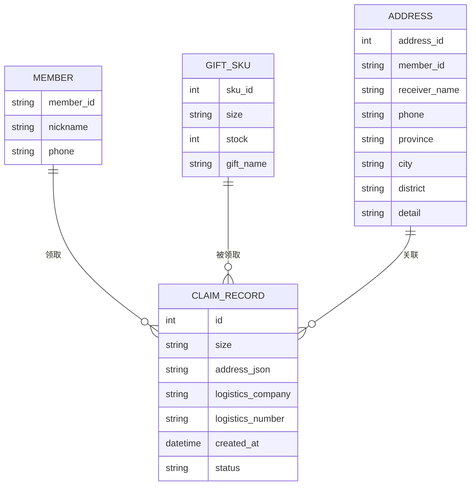
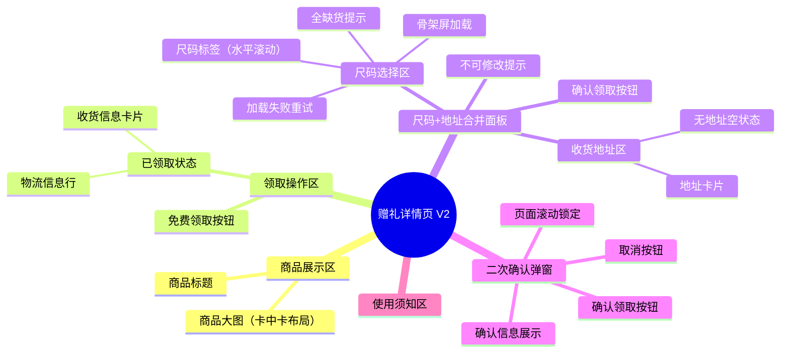
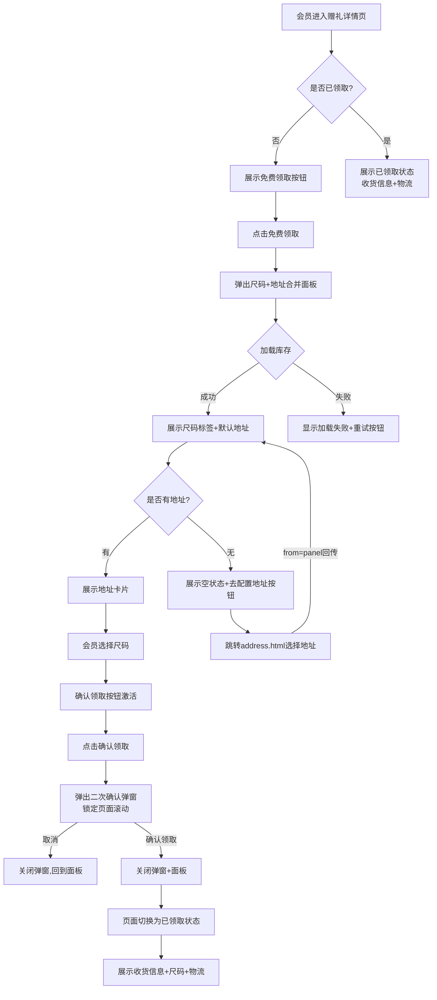

# 会员可以通过赠礼详情页选择尺码并确认地址，完成会员福利赠礼领取

## 元数据
- 状态：开发中
- 父需求：会员福利赠礼体系
- 分类：会员
- 业务：会员福利
- 迭代：2026年7月迭代
- 处理人：待定
- 优先级：High
- 需求类型：新功能
- 需求难度：B 现有能力迭代
- 技术等级：前端为主，后端配合
- 预估工时：5 人天

---

## 一、需求背景

### 1.1 业务大背景

美柚会员体系持续升级，赠礼福利作为会员核心权益之一，需提升领取体验的完整性与闭环。当前赠礼详情页仅支持"点击领取"，缺乏尺码选择、地址确认、物流跟踪等完整链路的体验支撑，制约了会员权益的感知价值和运营效率。

### 1.2 业务子背景

- 美柚会员专属赠礼多为实物商品（如哺乳文胸、母婴用品），涉及多尺码、多SKU的库存管理。
- 会员在领取实物赠礼时，需要选择尺码（S/M/L/XL/XXL 等），并确认收货地址，才能完成有效领取。
- 当前"一键领取"的模式无法收集尺码与地址信息，实际上导致后端需要人工补录，运营效率低下，且会员无法追踪物流，体验断裂。

### 1.3 现状判断及问题

| 现状 | 问题判断 | 历史需求 | 解决方案 |
| --- | --- | --- | --- |
| 赠礼详情页仅有一键领取按钮，无尺码选择和地址确认能力 | 会员无法表达尺码偏好，领取后需运营人工联系补录信息，效率低、体验差 | 无 | 新增尺码选择+地址确认合并面板，一步完成信息收集 |
| 赠礼商品图片为白色摄影棚底色，与页面渐变背景视觉不协调 | 图片与背景色差明显，视觉体验不佳，影响品牌调性 | 无 | 采用「卡中卡」布局，图片内嵌于品牌色卡片中，加圆角和阴影形成层次感 |
| 领取后无物流信息展示，会员需通过客服查询 | 会员无法自助追踪物流，增加客服压力 | 无 | 已领取状态下展示收货信息+物流单号+复制功能 |
| 缺乏领取二次确认机制，存在误操作风险 | 会员可能误触领取，且确认后信息不可修改，缺乏防错设计 | 无 | 增加二次确认弹窗，明确告知"提交后不可修改" |

---

## 二、项目目标

### 2.1 目标描述

1. **完整领取闭环**：会员可在赠礼详情页完成「选尺码 → 确认地址 → 二次确认 → 查看物流」全链路操作，无须人工介入。
2. **运营提效**：后端自动收集尺码+地址数据，消除人工补录环节，单次领取处理效率提升 >80%。
3. **视觉统一**：图片展示与页面品牌色协调一致，符合美柚女性友好设计规范。
4. **防错设计**：二次确认弹窗 + 不可修改提示，降低误操作投诉。

### 2.2 迭代节奏

| 阶段 | 内容 | 时间 |
| --- | --- | --- |
| 第一阶段 | 尺码选择面板（水平滚动标签）、地址确认面板合并、已领取状态展示 | 7月中旬 |
| 第二阶段 | 二次确认弹窗、物流信息展示与复制、图片视觉优化 | 7月下旬 |
| 第三阶段 | 地址管理页打通、缺货/异常态处理、数据上报 | 8月 |

### 2.3 风险预判

| 风险项 | 影响 | 应对 |
| --- | --- | --- |
| 尺码库存实时变化，选中后可能售罄 | 领取失败，用户体验受损 | 前端不做预占库存，提交时后端校验，失败则提示"所选尺码已售罄" |
| 地址选择页（address.html）与主流程参数传递兼容 | 地址回传丢失导致面板地址为空 | 使用 `from=panel` 参数区分来源，回传时保留参数 |
| 图片供应商更换产品图风格不统一 | 卡中卡布局适配性下降 | CSS 独立控制图片区域，不依赖图片自身风格 |

---

## 三、需求方案

### 3.1 名词定义

| 名词 | 定义 |
| --- | --- |
| 赠礼详情页 | 会员进入福利领取的落地页，展示商品信息、领取按钮、使用须知等 |
| 尺码面板 | 从底部弹出的 Sheet 面板，包含尺码标签选择区 + 收货地址区 + 确认按钮 |
| 尺码标签 | 水平可滚动排列的圆角胶囊按钮，表示各尺码及库存状态 |
| 已售罄态 | 库存为 0 的尺码标签置灰、半透明、加删除线，不可点击 |
| 二次确认弹窗 | 固定视口居中的模态弹窗，在会员点击"确认领取"后弹出，要求二次确认 |
| 已领取状态 | 确认领取后页面的终态，展示灰色"已领取"按钮 + 收货信息 + 物流信息 |

### 3.2 E-R 图

### 3.3 产品结构图

### 3.4 产品流程图

### 3.5 原型图

- 本地原型文件：`赠礼详情页-支持选尺码/index-v2.html`
- 线上预览：https://zhangjiamin-xiaoyouzi.github.io/meiyou-gift-detail/index-v2.html
- 地址选择页：`赠礼详情页-支持选尺码/address.html`

### 3.6 需求说明

| 功能模块 | 功能点 | 优先级 | 详细说明 |
| --- | --- | --- | --- |
| 商品展示 | 图片卡中卡布局 | P0 | 外层卡片保留品牌渐变背景（粉→香槟→灰粉），图片内嵌于卡片中，四周留 10px 内边距，图片圆角 12px + 微阴影 `0 2px 12px rgba(0,0,0,0.08)`，形成"相框中的照片"层次感 |
| 商品展示 | 商品标题展示 | P1 | 展示完整商品名称，单行溢出换行，字号 20px 粗体 |
| 领取操作 | 免费领取按钮 | P0 | 粉色渐变圆角胶囊按钮（#ff4b91 → #fb3d82），宽度自适应（min(190px, 70%)），固定高度 38px，点击打开尺码面板 |
| 领取操作 | 按钮 hover/active 态 | P2 | hover 上浮 1px + 阴影加深，active 下压 1px，focus 粉色描边 |
| 尺码面板 | 面板弹出动画 | P0 | 底部 Sheet 面板，position:fixed，z-index:200，从 translateY(100%) 滑入，380ms cubic-bezier(0.22, 0.98, 0.32, 1) |
| 尺码面板 | 骨架屏加载 | P0 | 面板打开时先展示 3 个 70×40px 灰色骨架标签，shimmer 动画（1.4s ease infinite），数据返回后隐藏 |
| 尺码面板 | 尺码标签渲染 | P0 | 水平 flex 布局，gap: 10px，不可换行，支持横向滚动（overflow-x: auto），滚动条隐藏。每个标签 min-width: 62px，height: 40px，圆角胶囊形，padding: 0 20px |
| 尺码面板 | 尺码选中态 | P0 | 选中标签：border-color 变为粉色，背景 #fff0f5，文字变粉色加粗，外加 2px 粉色外发光 box-shadow |
| 尺码面板 | 已售罄态 | P0 | 库存为 0 的标签：opacity 0.45，背景 #f0f0f2，文字删除线，追加"已售罄"副文字（12px），cursor: not-allowed，不可点击 |
| 尺码面板 | 全缺货提示 | P1 | 所有尺码库存为 0 时，显示 😔 图标 + "该商品所有尺码均已售罄，请关注下次补货"，确认按钮置灰 |
| 尺码面板 | 加载失败重试 | P1 | 接口异常时显示错误文案 + "重新加载"按钮（粉色边框空心样式），点击重新调用 fetchStock() |
| 尺码面板 | 滚动渐隐提示 | P2 | 标签超出容器时右侧显示白色渐变遮罩（linear-gradient 270deg），提示可滑动；内容不超出时隐藏 |
| 收货地址 | 默认地址加载 | P0 | 面板打开时调用 getDefaultAddress() 获取最近一次收货地址，填入面板地址卡片。首次领取无地址则显示空状态 |
| 收货地址 | 地址卡片展示 | P0 | 灰色背景卡片（#f6f6f8），圆角 12px，flex 布局：左侧（姓名 16px 粗体 + 电话 14px 灰色 + 地址 13px 单行省略），右侧粉色边框"更换"按钮 |
| 收货地址 | 无地址空状态 | P1 | 居中显示"暂未配置收货地址"+ "去配置地址"按钮（粉色边框空心），确认按钮置灰 |
| 收货地址 | 更换地址跳转 | P0 | 点击"更换"或"去配置地址"，跳转 address.html，携带 `?from=panel` 参数。地址页选择完成后回传 name/phone/addr 参数，前端 parseAddressFromURL 检测 from=panel 后重新打开面板并刷新地址 |
| 确认领取 | 确认按钮逻辑 | P0 | 按钮在未选尺码 或 无地址时 disabled（灰色不可点击）。选中尺码+有地址后激活（粉色渐变）。按钮文案"确认领取"，圆角胶囊 48px 高，全宽 |
| 确认领取 | 不可修改提示 | P1 | 按钮上方粉色提示条（#fff0f5 背景，圆角 8px）"确认地址及尺码以后不可修改" |
| 二次确认 | 弹窗样式 | P0 | position:fixed 全视口遮罩（rgba(0,0,0,0.45)），z-index:300，flex 居中。卡片 300px 宽，白色背景，圆角 20px，padding 32px 28px 24px，缩放弹出动画（scale 0.8→1）+ 淡入 |
| 二次确认 | 弹窗内容 | P0 | 📮 图标（64px 圆形粉色渐变底色）、主文案"确认提交领取？"（18px 粗体）、副文案"提交后将无法修改地址与尺码"（13px 粉色）、两个操作按钮 |
| 二次确认 | 操作按钮 | P0 | 取消按钮：白色底、灰色边框、灰色文字，flex:1，48px 高。确认领取按钮：粉色渐变（#ff3f8a → #f92f78）、白色文字、flex:1，阴影效果。active 缩放 0.97 |
| 二次确认 | 页面滚动锁定 | P1 | 弹窗打开时 `document.body.style.overflow = "hidden"`，关闭时恢复，防止弹窗背后页面滚动出现空白 |
| 已领取状态 | 状态行展示 | P0 | 免费领取按钮区域替换为：灰色按钮"已领取"（cursor:default）+ "预计 X 个工作日内寄出"文字。入场动画 fadeSlideIn（350ms ease） |
| 已领取状态 | 收货信息卡片 | P0 | 灰色背景卡片展示：收件人全名 + 脱敏手机号（中间4位星号）+ 完整地址 + 尺码行（如"尺码：XL"）。address.html 回传时已脱敏，前端直接展示 |
| 已领取状态 | 物流信息行 | P1 | 灰色背景行展示：未发货时显示"🚚 等待发货"；已发货时显示快递公司名 + 物流单号（可选中复制）+ "复制"按钮（粉色边框，点击后变绿色"已复制"+ Toast 提示） |
| Toast | 全局提示 | P2 | position:fixed，底部居中，黑底白字圆角胶囊，opacity 过渡 280ms，自动 1.8s 消失 |
| 使用须知 | 使用须知卡片 | P2 | 白色卡片，顶部标题行（📋 + "使用须知" 17px 粗体）+ 分隔线 + 5 条须知文本（14px 灰色），底部 margin 留白 |
| 导航栏 | 状态栏+导航 | P2 | 模拟手机状态栏（时间、美柚 App 标识、信号/电量图标）+ 页面导航（返回箭头、会员标识、品牌名称） |

### 3.7 协同方需求

| 协同方 | 配合内容 | 备注 |
| --- | --- | --- |
| 后端 | 提供尺码库存查询接口（GET /gift/sku/stock），返回各尺码对应库存量；提供领取提交接口（POST /gift/claim），接收 size + address_id，返回物流信息 | 库存查询需支持异常容错，前端做骨架屏+重试 |
| 后端 | 提供默认地址接口（GET /member/address/default），返回最近一次使用的收货地址 | 首次领取无地址需返回空 |
| 后端 | 提供物流查询接口（GET /gift/logistics），返回快递公司名+物流单号 | 未发货时返回空 |
| 运营 | 配置赠礼商品信息（名称、图片、SKU尺码对应关系、使用须知文本） | 图片建议统一白底风格以适配卡中卡布局 |
| 设计 | 提供商品白底图/透明底图、确认弹窗图标资源 | 如需进一步优化视觉融合效果 |
| 前端（地址页） | address.html 需保留 from=panel 参数回传逻辑，确保面板地址刷新正常 | 已完成 |
